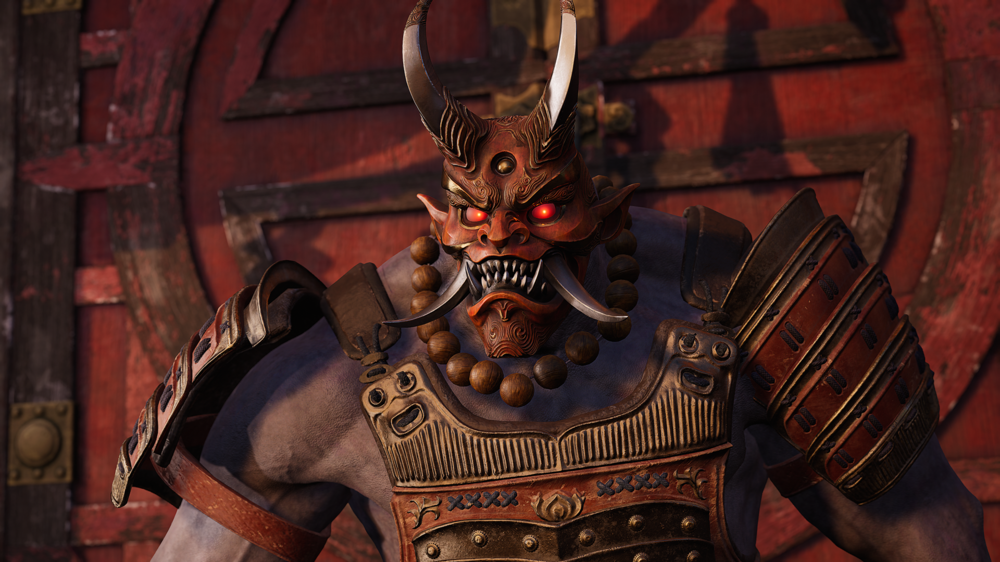

# super_resolution_SRResnet_kaggle
Image Super-Resolution using SRResNet for Gaming Visuals [https://www.kaggle.com/competitions/gnr638/overview]


# SRResNet Image Super-Resolution (Kaggle)

PyTorch implementation of **SRResNet** for 4× single-image super-resolution, built for a Kaggle competition workflow end-to-end: train/val split, checkpointing by PSNR, test-time inference, and Kaggle submission generation (base64-encoded PNGs in a CSV). 

---

## Qualitative Results

| Low-Resolution (input) | High-Resolution (target / output) |
|---|---|
| .png) |  |
| .png) |  |


## Highlights

- **SRResNet (×4)** with residual blocks + global skip connection + PixelShuffle upsampling. [file:18][file:17]
- Trains on paired `LR/HR` images using **L1 loss**, validates with **PSNR (dB)**. [file:18][file:17]
- Automatic deterministic split: **4500 pairs → 3825 train / 675 val** using `RANDOMSEED=42` and `VALSPLITRATIO=0.15`. [file:18][file:19]
- Saves the best checkpoint to `checkpointsandoutputs/bestsrresnetsplit.pth` when validation PSNR improves. [file:18][file:19]
- Generates `testpredictions/` and a ready-to-submit `submission.csv` in the required Kaggle format. [file:18]

---

## Repository Layout

```
.
├── train.py                 # Training + validation + inference + submission pipeline[1]
├── training_log_split.txt   # Example training log (loss/PSNR, timing)[2]
├── training_plots.jpg       # Example curves (loss + PSNR)[3]
└── gnr638_kaggle.pdf        # Report describing architecture + experiments[4]
```

---

## Setup

### Environment

This repo expects standard PyTorch + CV dependencies (the training script imports torch/torchvision, OpenCV, pandas, skimage, tqdm). [file:18]

> Note: the included `requirements.txt` only lists `numpy` and `matplotlib`, but `train.py` additionally requires `torch`, `torchvision`, `opencv-python`, `pandas`, `scikit-image`, and `tqdm`. [file:16][file:18]

A typical install:

```
python -m venv .venv
source .venv/bin/activate

# Install PyTorch per your CUDA setup from pytorch.org, then:
pip install numpy matplotlib pandas opencv-python scikit-image tqdm
pip install torchvision  # if not installed with torch
```

---

## Data Layout (Kaggle)

The training code expects:

- Training pairs under: `train-kaggle/lr/` and `train-kaggle/hr/` (matching filenames). 
- Test LR images under: `lr/lr/` (as configured by `TESTDATADIR = "lr"` and then enumerating files inside it). 

Concretely:

```
train-kaggle/
  lr/
    0001.png
    0002.png
    ...
  hr/
    0001.png
    0002.png
    ...

lr/
  lr/
    test_0001.png
    ...
```

If your Kaggle dataset folders differ, update `DATADIR` and `TESTDATADIR` at the top of `train.py`.

---

## Train + Validate + Submit

Single command does everything:

```
python train.py
```

What it does:

- Splits data into train/val, builds DataLoaders, trains SRResNet for `NUMEPOCHS` epochs. 
- Logs metrics to `checkpointsandoutputs/traininglogsplit.txt` and saves a plot image. 
- Saves best checkpoint by validation PSNR to `checkpointsandoutputs/bestsrresnetsplit.pth`. 
- Runs inference over **500** test images and writes outputs to `checkpointsandoutputs/testpredictions/`. 
- Creates `checkpointsandoutputs/submission.csv` with base64-encoded PNGs for Kaggle upload. 

---

## Default Hyperparameters (from code)

Key settings (edit in `train.py`):

- Upscale factor: `UPSCALEFACTOR = 4` 
- Residual blocks: `NUMRESBLOCKS = 16` 
- Epochs: `NUMEPOCHS = 100`
- Batch size: `BATCHSIZE = 8` 
- LR: `LEARNINGRATE` (configured in script; logging shows runs with `0.0001`).
- Validation split: `VALSPLITRATIO = 0.15`, seed `RANDOMSEED = 42`.

---

## Results (example run)

From the provided run logs:

- Best validation PSNR: **25.970 dB** at epoch 99, checkpoint saved.
- Final epoch (100) losses: train L1 ≈ **0.0309**, val L1 ≈ **0.0308**. 

The example curves are available in `training_plots.jpg` (loss decreasing; PSNR generally rising with occasional dips). 

---

## Notes / Tips

- If you hit CUDA OOM, reduce `BATCHSIZE` in `train.py`. 
- The submission encoder uses OpenCV to read predicted images and encodes them as PNG bytes → base64.
- To add augmentations, edit `traintransform` (currently `ToTensor()` only). 
